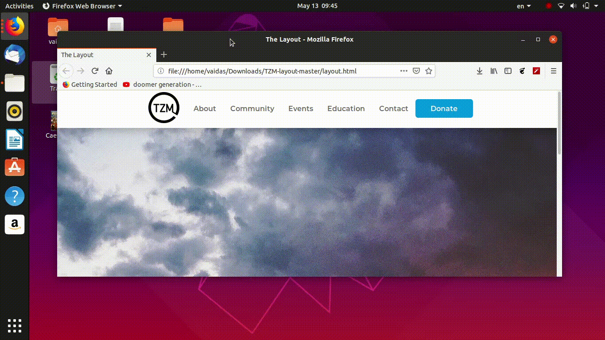

# TZM-layout

Highly experimental content ahead, do not use in production.

A long while ago I was experimenting with the latest CSS layout technologies such as CSS Grid and multiple others like media queries, I decided to improve the layout of sticky navbar for the shake of putting everything I knew at the time in practice.

Pros of using latest CSS Grid and Flex layout web technologies: 
1. downloading size decrease, 
2. loading, and rendering is more efficient and smooth
